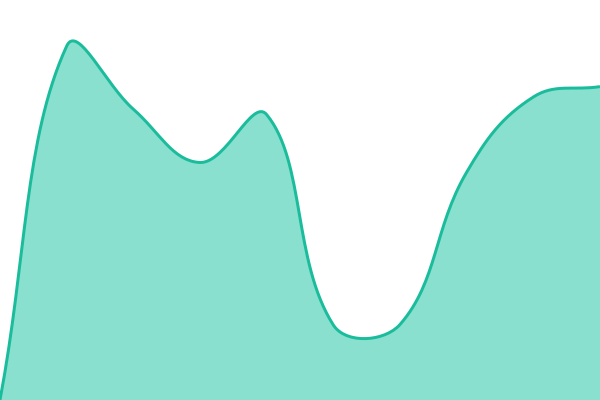
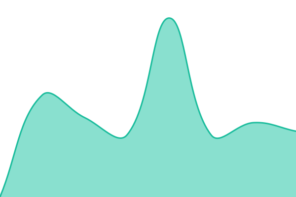

# [📈 Live Status](https://demo.upptime.js.org): <!--live status--> **🟩 All systems operational**

This repository contains the open-source uptime monitor and status page for [franco zuñiga](francozuniga32.github.io), powered by [Upptime](https://github.com/upptime/upptime).

With [Upptime](https://upptime.js.org), you can get your own unlimited and free uptime monitor and status page, powered entirely by a GitHub repository. We use [Issues](https://github.com/francoZuniga32/pedco-status/issues) as incident reports, [Actions](https://github.com/francoZuniga32/pedco-status/actions) as uptime monitors, and [Pages](https://demo.upptime.js.org) for the status page.

<!--start: status pages-->
<!-- This summary is generated by Upptime (https://github.com/upptime/upptime) -->
<!-- Do not edit this manually, your changes will be overwritten -->
<!-- prettier-ignore -->
| URL | Status | History | Response Time | Uptime |
| --- | ------ | ------- | ------------- | ------ |
|  [FAI-web](https://www.fi.uncoma.edu.ar/) | 🟩 Up | [fai-web.yml](https://github.com/francoZuniga32/pedco-status/commits/HEAD/history/fai-web.yml) | 

 2687ms
     
 | 

<a href="https://francoZuniga32.github.io/pedco-status/history/fai-web">100.00%</a>
    

|  [PEDCO](https://pedco.uncoma.edu.ar/) | 🟩 Up | [pedco.yml](https://github.com/francoZuniga32/pedco-status/commits/HEAD/history/pedco.yml) | 

 1897ms
     
 | 

<a href="https://francoZuniga32.github.io/pedco-status/history/pedco">100.00%</a>
    

|  [SIU Guarani - FAI](https://wguarani.uncoma.edu.ar/) | 🟩 Up | [siu-guarani-fai.yml](https://github.com/francoZuniga32/pedco-status/commits/HEAD/history/siu-guarani-fai.yml) | 

 2403ms
     
 | 

<a href="https://francoZuniga32.github.io/pedco-status/history/siu-guarani-fai">66.83%</a>
    

|  [Debian FAI](https://wguarani.uncoma.edu.ar/autogestion/) | 🟩 Up | [debian-fai.yml](https://github.com/francoZuniga32/pedco-status/commits/HEAD/history/debian-fai.yml) | 

 747ms
     
 | 

<a href="https://francoZuniga32.github.io/pedco-status/history/debian-fai">66.88%</a>
    

|  [CEFAI](https://cefai.fi.uncoma.edu.ar/) | 🟩 Up | [cefai.yml](https://github.com/francoZuniga32/pedco-status/commits/HEAD/history/cefai.yml) | 

 1584ms
     
 | 

<a href="https://francoZuniga32.github.io/pedco-status/history/cefai">100.00%</a>
    

<!--end: status pages-->

[**Visit our status website →**](https://demo.upptime.js.org)

## 📄 License

- Powered by: [Upptime](https://github.com/upptime/upptime)
- Code: [MIT](./LICENSE) © [franco zuñiga](francozuniga32.github.io)
- Data in the `./history` directory: [Open Database License](https://opendatacommons.org/licenses/odbl/1-0/)
